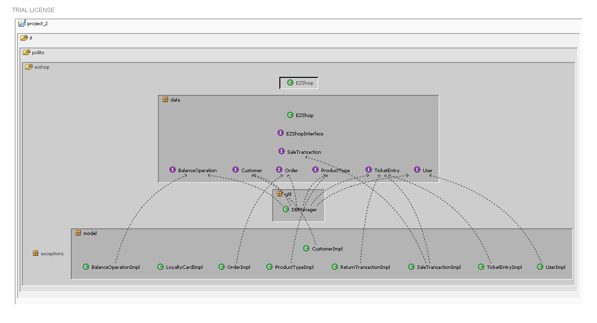
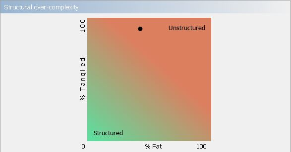
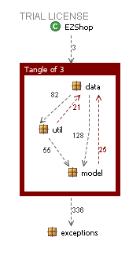
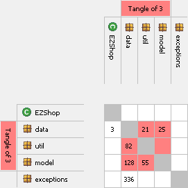

# Design assessment


```
<The goal of this document is to analyse the structure of your project, compare it with the design delivered
on April 30, discuss whether the design could be improved>
```

# Levelized structure map


# Structural over complexity chart




# Size metrics


| Metric                                    | Measure |
| ----------------------------------------- | ------- |
| Packages                                  |    7     |
| Classes (outer)                           |    39     |
| Classes (all)                             |   39      |
| NI (number of bytecode instructions)      |    8,321     |
| LOC (non comment non blank lines of code) |   3,578 |


# Items with XS

| Item | Tangled | Fat  | Size | XS   |
| ---- | ------- | ---- | ---- | ---- |
| (package) it.polito.ezshop    |    7%      |   7   |  8,321    |  588 |
| (class) it.polito.ezshop.data.EZShop    |    | 133  |  3,757    |  367    |
|  (method)it.polito.ezshop.data.EZShop.receiveCreditCardPayment(java.lang.Integer, java.lang.String):boolean||17|200| 23|
|  (method)it.polito.ezshop.data.EZShop.returnProduct(java.lang.Integer, java.lang.String, int):boolean ||16|165	|10|
|  (method)it.polito.ezshop.data.EZShop.deleteProductFromSale(java.lang.Integer, java.lang.String, int):boolean| | 16 |159	 |9 |


# Package level tangles




# Summary analysis


<br>
The main weaknesses of the project's structure are the <b>tangles</b> (over 90%).
The <b>Levelized structure map</b> shows backward dependencies between classes in package model and their respective interfaces in package data. A way to lower this percentage could be to move the Interfaces from data TO model package. Regarding the <b>Fat</b> (45%) the only class affected is EZShop class inside package data, by the way it is linked to the fact that it contains all the project's logic (API). Moreover 3 fat methods are present, in the end we have no items that exceed the threshold for Fat at the design and the leaf package level.

The main differences of the current structure of our project with respect to the <b>design</b> delivered on April 30th are:
<ul>
<li>The presence of the util package which contains the class DBManager who's in charge of managing data persistency through the Database(previous model included data structures such as lists and maps to manipulate data) </li>
<li>The substitution of Credit and Debit classes with an attribute "type" inside the BalanceOperation class that can assume 2 values: DEBIT (-) , CREDIT (+) </li>
<li>The substitution of Position class with an attribute, of type String, inside the ProductType class</li>
<li>We've deleted the class AccountBook; all the information related to it are now managed through DB operations</li>
<li> We've added the class TicketEntry according to the Interface already present in the package data</ul>
</li>
<br>

