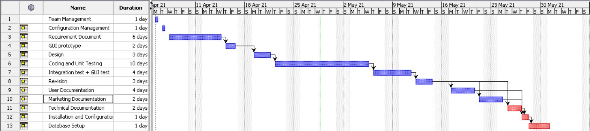

1
2
3
4
5
6
7
8
9
10
11
12
13
14
15
16
17
18
19
20
21
22
23
24
25
26
27
28
29
30
31
32
33
34
35
36
37
38
39
40
41
42
43
44
45
46
47
48
49
50
51
# Project Estimation  
Authors: Sébastien Cadusseau, Michele Formisano, Andrea Gaminara, Andrea Lafratta. 
 Date: 28/04/2021 
 Version: 1.0 
# Contents
- [Estimate by product decomposition]
- [Estimate by activity decomposition ]
# Estimation approach
<Consider the EZGas  project as described in YOUR requirement document, assume that you are going to develop the project INDEPENDENT of the deadlines of the course>
# Estimate by product decomposition
### 
|             | Estimate                        |             
| ----------- | ------------------------------- |  
| NC =  Estimated number of classes to be developed   |NC = 16 |             
|  A = Estimated average size per class, in LOC       |       A = 115                     | 
| S = Estimated size of project, in LOC (= NC * A) | S = NC*A = 16*115 = 1840 |
| E = Estimated effort, in person hours (here use productivity 10 LOC per person hour)  | 10 LOC/1ph -> E = 184 ph                                     |   
| C = Estimated cost, in euro (here use 1 person hour cost = 30 euro) |C = 30 euro*148.5 ph = 5520  euro | 
| Estimated calendar time, in calendar weeks (Assume team of 4 people, 8 hours per day, 5 days per week ) |    32 ph/day * 5 day/week = 160 ph/week  184  ph / 160 ph/week = 1.15 weeks  = 1 week and 1 day  |
                              
# Estimate by activity decomposition
### 
|         Activity name    | Estimated effort (person hours)   |             
| ----------- | ------------------------------- | 
|Team Management |32 ph |
|Configuration Management |32 ph |
|Requirement Document  |192 ph|
|GUI prototype |64 ph |
|Design |96 ph |
|Coding and Unit Testing |320 ph |
|Integration test  + GUI test |128 ph |
|Revision |96 ph |
|User Documentation |120 ph |
|Marketing Documentation |64 ph |
|Technical Documentation |64 ph |
|Installation and Configuration |32 ph |
|Database Setup |32 ph |

###
<b>Gantt chart with above activities<b>

