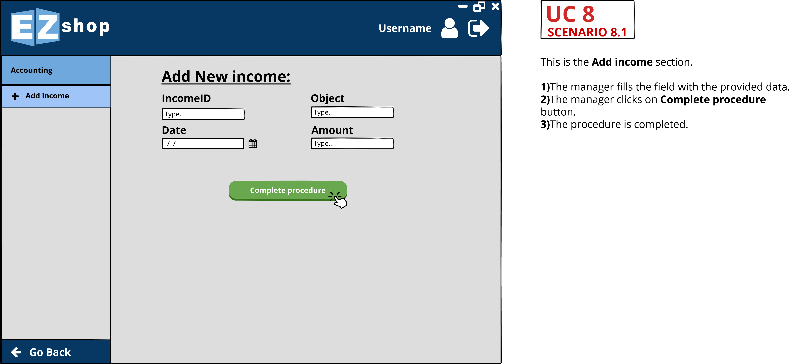

# Graphical User Interface Prototype  

Authors: Sébastien Cadusseau, Michele Formisano, Andrea Gaminara, Andrea Lafratta.

Date: 19/03/2021

Version: 1.0

# Contents 
- [UC1 Log in](#uc1-log-in)
	+ [Scenario 1_1](#scenario-1_1)
	+ [Scenario 1_2](#scenario-1_2)
- [UC2 Creating user account](#uc2-creating-user-account)
	+ [Scenario 2_1](#scenario-2_1)
	+ [Scenario 2_2](#scenario-2_2)
- [UC3 Add a new product](#uc3-add-a-new-product)
	+ [Scenario 3_1](#scenario-3_1)
	+ [Scenario 3_2](#scenario-3_2) 
- [UC4 Add a new order](#uc4-add-a-new-order)
	+ [Scenario 4_1](#scenario-4_1)
- [UC5 Modify an order](#uc5-modify-an-order)
	+ [Scenario 5_1](#scenario-5_1)
- [UC6 Manage Sales](#uc6-manage-sales)
	+ [Scenario 6_1](#scenario-6_1)
	+ [Scenario 6_2](#scenario-6_2)
	+ [Scenario 6_3](#scenario-6_3)
- [UC7 Create a fidelity card](#uc7-create-a-fidelity-card)
	+ [Scenario 7_1](#scenario-7_1)
- [UC8 Add new expense/income](#uc8-add-new-expense-or-income)
	+ [Scenario 8_1](#scenario-8_1)	
- [UC9 Check profit/loss](#uc9-check-profit-or-loss)
	+ [Scenario 9_1](#scenario-9_1) 

# UC1 Log in

## Scenario 1_1

   
## Scenario 1_2

   

   

   
# UC2 Creating user account
## Scenario 2_1

   
## Scenario 2_1

   
## Scenario 2_2

   

   
# UC3 Add a new product
## Scenario 3_1

   
## Scenario 3_2

   

   
# UC4 Add a new order
## Scenario 4_1

   
# UC5 Modify an order
## Scenario 5_1

   
# UC6 Manage Sales 
## Scenario 6_1

   
## Scenario 6_2

   
## Scenario 6_3

   

   
# UC7 Create a fidelity card
## Scenario 7_1

   

   
# UC8 Add new expense or income
## Scenario 8_1

   
# UC9 Check profit or loss
## Scenario 9_1

