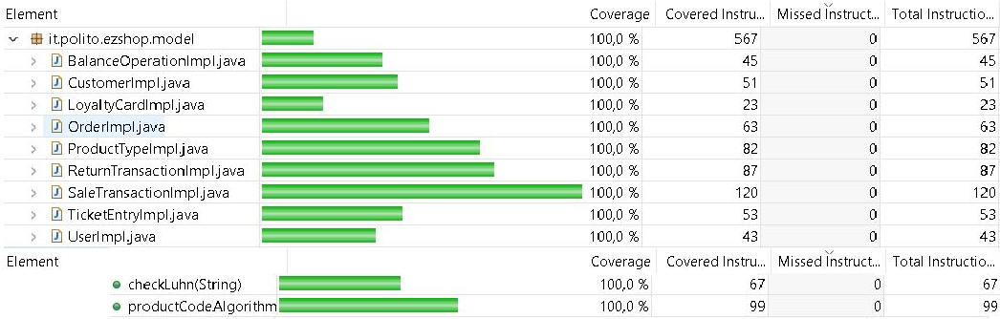

# Unit Testing Documentation

Authors: Sébastien Cadusseau, Michele Formisano, Andrea Gaminara, Andrea Lafratta.

Date: 19/05/2021

Version: 1.0

# Contents

- [Black Box Unit Tests](#black-box-unit-tests)

- [White Box Unit Tests](#white-box-unit-tests)

# Black Box Unit Tests

    <Define here criteria, predicates and the combination of predicates for each function of each class.
    Define test cases to cover all equivalence classes and boundary conditions.
    In the table, report the description of the black box test case and (traceability) the correspondence with the JUnit test case writing the 
    class and method name that contains the test case>
    <JUnit test classes must be in src/test/java/it/polito/ezshop   You find here, and you can use,  class TestEzShops.java that is executed  
    to start tests
    >

 ### **Class *ProductImpl* - method *setRFID***

**Criteria for method *setRFID*:**
	

 - Setting a correct product RFID

**Predicates for method *setRFID*:**

| Criteria                    | Predicate |
| --------------------------- | --------- |
| Setting a correct product RFID| Long    |

**Boundaries**:

| Criteria |      |
| -------- | ---- |
|          |      |

**Combination of predicates**:

| Setting a correct product RFID | Valid / Invalid | Description of the test case   | JUnit test case |
| --------------------------- | --------------- | ------------------------------ | --------------- |
| Long                      | Valid           | setRFID(Long RFID)-> success | testSetRFID()   |

 ### **Class *ProductImpl* - method *setBarCode***

**Criteria for method *setBarCode*:**
	

 - Setting a correct product BarCode

**Predicates for method *setBarCode*:**

| Criteria                    | Predicate |
| --------------------------- | --------- |
| Setting a correct product BarCode| String   |

**Boundaries**:

| Criteria |      |
| -------- | ---- |
|          |      |

**Combination of predicates**:

| Setting a correct product BarCode | Valid / Invalid | Description of the test case   | JUnit test case |
| --------------------------- | --------------- | ------------------------------ | --------------- |
| String                    | Valid           | setBarCode(String barCode)-> success | testSetBarCode()   |

 ### **Class *LoyaltyCardImpl* - method *setCardCode***

**Criteria for method *setCardCode*:**
	

 - Setting a correct card code

**Predicates for method *setCardCode*:**

| Criteria                    | Predicate |
| --------------------------- | --------- |
| Setting a correct card code | String    |

**Boundaries**:

| Criteria |      |
| -------- | ---- |
|          |      |

**Combination of predicates**:

| Setting a correct card code | Valid / Invalid | Description of the test case            | JUnit test case   |
| --------------------------- | --------------- | --------------------------------------- | ----------------- |
| String                      | Valid           | setCardCode(String cardCode) -> success | testSetCardCode() |

 ### **Class *LoyaltyCardImpl* - method *setPoints***

**Criteria for method *setPoints*:**
	

 - Setting a correct number of card points

**Predicates for method *setPoints*:**

| Criteria                                | Predicate |
| --------------------------------------- | --------- |
| Setting a correct number of card points | Integer   |

**Boundaries**:

| Criteria |      |
| -------- | ---- |
|          |      |

**Combination of predicates**:

| Setting a correct number of card points | Valid / Invalid | Description of the test case    | JUnit test case |
| --------------------------------------- | --------------- | ------------------------------- | --------------- |
| Integer                                 | Valid           | setPoints(Integer p) -> success | testSetPoints() |

 ### **Class *CustomerImpl* - method *setCustomerName***

**Criteria for method *setCustomerName*:**
	

 - Setting a correct customer name

**Predicates for method *setCustomerName*:**

| Criteria                        | Predicate |
| ------------------------------- | --------- |
| Setting a correct customer name | String    |

**Boundaries**:

| Criteria |      |
| -------- | ---- |
|          |      |

**Combination of predicates**:

| Setting a correct customer name | Valid / Invalid | Description of the test case          | JUnit test case       |
| ------------------------------- | --------------- | ------------------------------------- | --------------------- |
| String                          | Valid           | setCustomerName(String cN) -> success | testSetCustomerName() |

 ### **Class *CustomerImpl* - method *setCustomerCard***

**Criteria for method *setCustomerCard*:**
	

 - Setting a correct customer card

**Predicates for method *setCustomerCard*:**

| Criteria                        | Predicate |
| ------------------------------- | --------- |
| Setting a correct customer card | String    |

**Boundaries**:

| Criteria |      |
| -------- | ---- |
|          |      |

**Combination of predicates**:

| Setting a correct customer card | Valid / Invalid | Description of the test case          | JUnit test case       |
| ------------------------------- | --------------- | ------------------------------------- | --------------------- |
| String                          | Valid           | setCustomerCard(String cC) -> success | testSetCustomerCard() |

 ### **Class *CustomerImpl* - method *setId***

**Criteria for method *setId*:**
	

 - Setting a correct customer ID

**Predicates for method *setId*:**

| Criteria                      | Predicate |
| ----------------------------- | --------- |
| Setting a correct customer ID | Integer   |

**Boundaries**:

| Criteria |      |
| -------- | ---- |
|          |      |

**Combination of predicates**:

| Setting a correct customer ID | Valid / Invalid | Description of the test case | JUnit test case |
| ----------------------------- | --------------- | ---------------------------- | --------------- |
| Integer                       | Valid           | setId(Integer p) -> success  | testSetId()     |

 ### **Class *CustomerImpl* - method *setPoints***

**Criteria for method *setSetPoints*:**
	

 - Setting a correct number of customer card points

**Predicates for method *setSetPoints*:**

| Criteria                                         | Predicate |
| ------------------------------------------------ | --------- |
| Setting a correct number of customer card points | Integer   |

**Boundaries**:

| Criteria |      |
| -------- | ---- |
|          |      |

**Combination of predicates**:

| Setting a correct number of customer card points | Valid / Invalid | Description of the test case    | JUnit test case |
| ------------------------------------------------ | --------------- | ------------------------------- | --------------- |
| Integer                                          | Valid           | setPoints(Integer p) -> success | testSetPoints() |

 ### **Class *CustomerImpl* - method *setLoyaltyCard***

**Criteria for method *setLoyaltyCard*:**
	

 - Setting a valid Loyalty card for a customer

**Predicates for method *setLoyaltyCard*:**

| Criteria                                    | Predicate       |
| ------------------------------------------- | --------------- |
| Setting a valid Loyalty card for a customer | LoyaltyCard obj |

**Boundaries**:

| Criteria |      |
| -------- | ---- |
|          |      |

**Combination of predicates**:

| Setting a valid Loyalty card for a customer | Valid / Invalid | Description of the test case              | JUnit test case      |
| ------------------------------------------- | --------------- | ----------------------------------------- | -------------------- |
| LoyaltyCard obj                             | Valid           | setLoyaltyCard(LoyaltyCard lc) -> success | testSetLoyaltyCard() |

 ### **Class *UserImpl* - method *setId***

**Criteria for method *setId*:**
	

 - Setting a correct user ID

**Predicates for method *setId*:**

| Criteria                  | Predicate |
| ------------------------- | --------- |
| Setting a correct user ID | Integer   |

**Boundaries**:

| Criteria |      |
| -------- | ---- |
|          |      |

**Combination of predicates**:

| Setting a correct user ID | Valid / Invalid | Description of the test case     | JUnit test case |
| ------------------------- | --------------- | -------------------------------- | --------------- |
| Integer                   | Valid           | setUserID(Integer Id) -> success | testSetUserID() |

 ### **Class *UserImpl* - method *setUsername***

**Criteria for method *setUsername*:**
	

 - Setting a correct username

**Predicates for method *setUsername*:**

| Criteria                   | Predicate |
| -------------------------- | --------- |
| Setting a correct username | String    |

**Boundaries**:

| Criteria |      |
| -------- | ---- |
|          |      |

**Combination of predicates**:

| Setting a correct username | Valid / Invalid | Description of the test case     | JUnit test case   |
| -------------------------- | --------------- | -------------------------------- | ----------------- |
| String                     | Valid           | setUsername(String u) -> success | testSetUsername() |

 ### **Class *UserImpl* - method *setPassword***

**Criteria for method *setPassword*:**
	

 - Setting a user password

**Predicates for method *setPassword*:**

| Criteria                | Predicate |
| ----------------------- | --------- |
| Setting a user password | String    |

**Boundaries**:

| Criteria |      |
| -------- | ---- |
|          |      |

**Combination of predicates**:

| Setting a user password | Valid / Invalid | Description of the test case     | JUnit test case   |
| ----------------------- | --------------- | -------------------------------- | ----------------- |
| String                  | Valid           | setPassword(String p) -> success | testSetPassword() |

 ### **Class *OrderImpl* - method *setProductCode***

**Criteria for method *setProductCode*:**
	

 - Setting a correct product code for an ordered product

**Predicates for method *setProductCode*:**

| Criteria                                              | Predicate |
| ----------------------------------------------------- | --------- |
| Setting a correct product code for an ordered product | String    |

**Boundaries**:

| Criteria |      |
| -------- | ---- |
|          |      |

**Combination of predicates**:

| Setting a correct product code for an ordered product | Valid / Invalid | Description of the test case         | JUnit test case      |
| ----------------------------------------------------- | --------------- | ------------------------------------ | -------------------- |
| String                                                | Valid           | setProductCode(String pC) -> success | testSetProductCode() |

 ### **Class *OrderImpl* - method *setPricePerUnit***

**Criteria for method *setPricePerUnit*:**
	

 - Setting a correct price per unit for an ordered product

**Predicates for method *setPricePerUnit*:**

| Criteria                                                | Predicate             |
| ------------------------------------------------------- | --------------------- |
| Setting a correct price per unit for an ordered product | (mindouble,maxdouble) |

**Boundaries**:

| Criteria |      |
| -------- | ---- |
|          |      |

**Combination of predicates**:

| Setting a correct price per unit for an ordered product | Valid / Invalid | Description of the test case         | JUnit test case       |
| ------------------------------------------------------- | --------------- | ------------------------------------ | --------------------- |
| (mindouble,maxdouble)                                   | Valid           | setPricePerUnit(double p) -> success | testSetPricePerUnit() |

 ### **Class *OrderImpl* - method *setQuantity***

**Criteria for method *setQuantity*:**
	

 - Setting a correct quantity for an ordered product

**Predicates for method *setQuantity*:**

| Criteria                                          | Predicate       |
| ------------------------------------------------- | --------------- |
| Setting a correct quantity for an ordered product | (minint,maxint) |

**Boundaries**:

| Criteria |      |
| -------- | ---- |
|          |      |

**Combination of predicates**:

| Setting a correct quantity for an ordered product | Valid / Invalid | Description of the test case  | JUnit test case   |
| ------------------------------------------------- | --------------- | ----------------------------- | ----------------- |
| (minint,maxint)                                   | Valid           | setQuantity(Int q) -> success | testSetQuantity() |

 ### **Class *OrderImpl* - method *setStatus***

**Criteria for method *setStatus*:**
	

 - Setting a correct status for an order

**Predicates for method *setStatus*:**

| Criteria                              | Predicate |
| ------------------------------------- | --------- |
| Setting a correct status for an order | String    |

**Boundaries**:

| Criteria |      |
| -------- | ---- |
|          |      |

**Combination of predicates**:

| Setting a correct status for an order | Valid / Invalid | Description of the test case   | JUnit test case |
| ------------------------------------- | --------------- | ------------------------------ | --------------- |
| String                                | Valid           | setStatus(String s) -> success | testSetStatus() |

 ### **Class *OrderImpl* - method *setBalanceId***

**Criteria for method *setBalanceId*:**
	

 - Setting a correct balance id

**Predicates for method *setBalanceId*:**

| Criteria                     | Predicate |
| ---------------------------- | --------- |
| Setting a correct balance id | Integer   |

**Boundaries**:

| Criteria |      |
| -------- | ---- |
|          |      |

**Combination of predicates**:

| Setting a correct balance id | Valid / Invalid | Description of the test case       | JUnit test case    |
| ---------------------------- | --------------- | ---------------------------------- | ------------------ |
| Integer                      | Valid           | setBalanceId(Integer b) -> success | testSetBalanceId() |

 ### **Class *OrderImpl* - method *setOrderId***

**Criteria for method *setOrderId*:**
	

 - Setting a correct order id

**Predicates for method *setOrderId*:**

| Criteria                   | Predicate |
| -------------------------- | --------- |
| Setting a correct order id | Integer   |

**Boundaries**:

| Criteria |      |
| -------- | ---- |
|          |      |

**Combination of predicates**:

| Setting a correct order id | Valid / Invalid | Description of the test case     | JUnit test case  |
| -------------------------- | --------------- | -------------------------------- | ---------------- |
| Integer                    | Valid           | setOrderId(Integer o) -> success | testSetOrderId() |

 ### **Class *ProductTypeImpl* - method *setQuantity***

**Criteria for method *setQuantity*:**
	

 - Setting a correct quantity for a product

**Predicates for method *setQuantity*:**

| Criteria                                 | Predicate |
| ---------------------------------------- | --------- |
| Setting a correct quantity for a product | Integer   |

**Boundaries**:

| Criteria |      |
| -------- | ---- |
|          |      |

**Combination of predicates**:

| Setting a correct quantity for a product | Valid / Invalid | Description of the test case      | JUnit test case   |
| ---------------------------------------- | --------------- | --------------------------------- | ----------------- |
| Integer                                  | Valid           | setQuantity(Integer q) -> success | testSetQuantity() |

 ### **Class *ProductTypeImpl* - method *setLocation***

**Criteria for method *setLocation*:**
	

 - Setting a correct location for a product

**Predicates for method *setLocation*:**

| Criteria                                 | Predicate |
| ---------------------------------------- | --------- |
| Setting a correct location for a product | String    |

**Boundaries**:

| Criteria |      |
| -------- | ---- |
|          |      |

**Combination of predicates**:

| Setting a correct quantity for a product | Valid / Invalid | Description of the test case     | JUnit test case   |
| ---------------------------------------- | --------------- | -------------------------------- | ----------------- |
| String                                   | Valid           | setLocation(String l) -> success | testSetLocation() |

 ### **Class *ProductTypeImpl* - method *setNote***

**Criteria for method *setNote*:**
	

 - Setting a correct note for a product

**Predicates for method *setNote*:**

| Criteria                             | Predicate |
| ------------------------------------ | --------- |
| Setting a correct note for a product | String    |

**Boundaries**:

| Criteria |      |
| -------- | ---- |
|          |      |

**Combination of predicates**:

| Setting a correct note for a product | Valid / Invalid | Description of the test case | JUnit test case |
| ------------------------------------ | --------------- | ---------------------------- | --------------- |
| String                               | Valid           | setNote(String n) -> success | testSetNote()   |

 ### **Class *ProductTypeImpl* - method *setProductDescription***

**Criteria for method *setProductDescription*:**
	

 - Setting a correct product description

**Predicates for method *setProductDescription*:**

| Criteria                              | Predicate |
| ------------------------------------- | --------- |
| Setting a correct product description | String    |

**Boundaries**:

| Criteria |      |
| -------- | ---- |
|          |      |

**Combination of predicates**:

| Setting a correct product description | Valid / Invalid | Description of the test case                | JUnit test case             |
| ------------------------------------- | --------------- | ------------------------------------------- | --------------------------- |
| String                                | Valid           | setProductDescription(String pd) -> success | testSetProductDescription() |

 ### **Class *ProductTypeImpl* - method *setBarcode***

**Criteria for method *setBarcode*:**
	

 - Setting a correct product barcode

**Predicates for method *setBarcode*:**

| Criteria                          | Predicate |
| --------------------------------- | --------- |
| Setting a correct product barcode | String    |

**Boundaries**:

| Criteria |      |
| -------- | ---- |
|          |      |

**Combination of predicates**:

| Setting a correct product barcode | Valid / Invalid | Description of the test case    | JUnit test case  |
| --------------------------------- | --------------- | ------------------------------- | ---------------- |
| String                            | Valid           | setBarcode(String b) -> success | testSetBarcode() |

 ### **Class *ProductTypeImpl* - method *setPricePerUnit***

**Criteria for method *setPricePerUnit*:**
	

 - Setting a correct  price per unit of a product

**Predicates for method *setPricePerUnit*:**

| Criteria                                       | Predicate |
| ---------------------------------------------- | --------- |
| Setting a correct  price per unit of a product | Double    |

**Boundaries**:

| Criteria |      |
| -------- | ---- |
|          |      |

**Combination of predicates**:

| Setting a correct  price per unit of a product | Valid / Invalid | Description of the test case           | JUnit test case       |
| ---------------------------------------------- | --------------- | -------------------------------------- | --------------------- |
| Double                                         | Valid           | setPricePerUnit(Double pr)) -> success | testSetPricePerUnit() |

 ### **Class *ProductTypeImpl* - method *setId***

**Criteria for method *setId*:**
	

 - Setting a correct product ID

**Predicates for method *setId*:**

| Criteria                     | Predicate |
| ---------------------------- | --------- |
| Setting a correct product ID | Integer   |

**Boundaries**:

| Criteria |      |
| -------- | ---- |
|          |      |

**Combination of predicates**:

| Setting a correct product ID | Valid / Invalid | Description of the test case | JUnit test case |
| ---------------------------- | --------------- | ---------------------------- | --------------- |
| Integer                      | Valid           | setId(Integer id) -> success | testSetId()     |

 ### **Class *ProductTypeImpl* - method *modifyQuantity***

**Criteria for method *modifyQuantity*:**
	

 - Sign of quantity to be added

**Predicates for method *modifyQuantity*:**

| Criteria                     | Predicate       |
| ---------------------------- | --------------- |
| Sign of quantity to be added | (minint,maxint) |

**Boundaries**:

| Criteria | Boundary values |
| -------- | --------------- |
|          |                 |

**Combination of predicates**:

| Sign of quantity to be added | Valid / Invalid | Description of the test case     | JUnit test case      |
| ---------------------------- | --------------- | -------------------------------- | -------------------- |
| (minint,maxint)              | Valid           | modifyQuantity(int q) -> success | testModifyQuantity() |

 ### **Class *SaleTransactionImpl*** **method *setTicketNumber***

**Criteria for method *setTicketNumber*:**

 - Setting a correct Ticket number

**Predicates for method *setTicketNumber*:**

| Criteria                        | Predicate |
| ------------------------------- | --------- |
| Setting a correct Ticket number | Integer   |

**Boundaries**:

| Criteria |      |
| -------- | ---- |
|          |      |

**Combination of predicates**:

| Setting a correct Ticket number | Valid / Invalid | Description of the test case          | JUnit test case       |
| ------------------------------- | --------------- | ------------------------------------- | --------------------- |
| Integer                         | Valid           | setTicketNumber(Integer t) -> success | testSetTicketNumber() |

 ### **Class *SaleTransactionImpl*** method *setEntries*

**Criteria for method *setEntries*:**

 - Setting a correct list of Ticket entries

**Predicates for method *setEntries*:**

| Criteria                       | Predicate       |
| ------------------------------ | --------------- |
| Setting a correct Ticket entry | ListTicketEntry |

**Boundaries**:

| Criteria |      |
| -------- | ---- |
|          |      |

**Combination of predicates**:

| Setting a correct Ticket entry | Valid / Invalid | Description of the test case          | JUnit test case  |
| ------------------------------ | --------------- | ------------------------------------- | ---------------- |
| ListTicketEntry                | Valid           | setEntries(ListTicketEntry -> success | testSetEntries() |

 ### **Class *SaleTransactionImpl*** method *setDiscountRate*

**Criteria for method *setDiscountRate*:**

 - Setting a correct Discount rate for sale

**Predicates for method *setDiscountRate*:**

| Criteria                                 | Predicate             |
| ---------------------------------------- | --------------------- |
| Setting a correct Discount rate for sale | (mindouble,maxdouble) |

**Boundaries**:

| Criteria |      |
| -------- | ---- |
|          |      |

**Combination of predicates**:

| Setting a correct Discount rate for sale | Valid / Invalid | Description of the test case          | JUnit test case       |
| ---------------------------------------- | --------------- | ------------------------------------- | --------------------- |
| (mindouble,maxdouble)                    | Valid           | setDiscountRate(double dr) -> success | testSetDiscountRate() |

 ### **Class *SaleTransactionImpl*** **method *setPrice***

**Criteria for method *setPrice*:**

 - Setting a correct Sale price

**Predicates for method *setPrice*:**

| Criteria                     | Predicate             |
| ---------------------------- | --------------------- |
| Setting a correct Sale price | (mindouble,maxdouble) |

**Boundaries**:

| Criteria |      |
| -------- | ---- |
|          |      |

**Combination of predicates**:

| Setting a correct Sale price | Valid / Invalid | Description of the test case   | JUnit test case |
| ---------------------------- | --------------- | ------------------------------ | --------------- |
| (mindouble,maxdouble)        | Valid           | setPrice(double pr) -> success | testSetPrice()  |

 ### **Class *SaleTransactionImpl*** **method *setStatus***

**Criteria for method *setStatus*:**

 - Setting a correct sale status

**Predicates for method *setStatus*:**

| Criteria                      | Predicate |
| ----------------------------- | --------- |
| Setting a correct sale status | String    |

**Boundaries**:

| Criteria |      |
| -------- | ---- |
|          |      |

**Combination of predicates**:

| Setting a correct sale status | Valid / Invalid | Description of the test case    | JUnit test case |
| ----------------------------- | --------------- | ------------------------------- | --------------- |
| String                        | Valid           | setStatus(String st) -> success | testSetStatus() |

 ### **Class *SaleTransactionImpl*** **method *modifyEntryByBarcode***

**Criteria for method *modifyEntryByBarcode*:**

 - valid int amount
 - valid String

**Predicates for method *modifyEntryByBarcode*:**

| Criteria         | Predicate       |
| ---------------- | --------------- |
| valid int amount | (minint,maxint) |
| valid String     | String          |

**Boundaries**:

| Criteria | Boundary values |
| -------- | --------------- |
|          |                 |

**Combination of predicates**:

| valid int amount | valid String | Valid / Invalid | Description of the test case                        | JUnit test case            |
| ---------------- | ------------ | --------------- | --------------------------------------------------- | -------------------------- |
| (minint,maxint)  | String       | Valid           | modifyEntryByBarcode(String s, int amount)->success | testModifyEntryByBarcode() |

 ### **Class *TicketEntrylmpl*** **method *setBarCode***

**Criteria for method *setBarCode*:**

 - Setting a correct product barcode fort he ticket entry

**Predicates for method *setBarCode*:**

| Criteria                                               | Predicate |
| ------------------------------------------------------ | --------- |
| Setting a correct product barcode fort he ticket entry | String    |

**Boundaries**:

| Criteria |      |
| -------- | ---- |
|          |      |

**Combination of predicates**:

| Setting a correct product barcode for the ticket entry | Valid / Invalid | Description of the test case     | JUnit test case        |
| ------------------------------------------------------ | --------------- | -------------------------------- | ---------------------- |
| String                                                 | Valid           | setBarCode(String br) -> success | testTicketSetBarCode() |

 ### **Class *TicketEntrylmpl*** **method *setProductDescription***

**Criteria for method *setProductDescription*:**

 - Setting a correct product description for the ticket entry

**Predicates for method *setProductDescription*:**

| Criteria                                                   | Predicate |
| ---------------------------------------------------------- | --------- |
| Setting a correct product description for the ticket entry | String    |

**Boundaries**:

| Criteria |      |
| -------- | ---- |
|          |      |

**Combination of predicates**:

| Setting a correct product description for the ticket entry | Valid / Invalid | Description of the test case               | JUnit test case                   |
| ---------------------------------------------------------- | --------------- | ------------------------------------------ | --------------------------------- |
| String                                                     | Valid           | setProductDescription(String d) -> success | testTicketSetProductDescription() |

 ### **Class *TicketEntrylmpl*** **method *setAmount***

**Criteria for method *setAmount*:**

 - Setting a correct amount for the ticket entry

**Predicates for method *setAmount*:**

| Criteria                                      | Predicate       |
| --------------------------------------------- | --------------- |
| Setting a correct amount for the ticket entry | (minint,maxint) |

**Boundaries**:

| Criteria |      |
| -------- | ---- |
|          |      |

**Combination of predicates**:

| Setting a correct amount for the ticket entry | Valid / Invalid | Description of the test case | JUnit test case       |
| --------------------------------------------- | --------------- | ---------------------------- | --------------------- |
| (minint,maxint)                               | Valid           | setAmount(int a) -> success  | testTicketSetAmount() |

 ### **Class *TicketEntrylmpl*** **method *setPricePerUnit***

**Criteria for method *setPricePerUnit*:**

 - Setting a correct price per unit of the product for the ticket entry

**Predicates for method *setPricePerUnit*:**

| Criteria                                                     | Predicate             |
| ------------------------------------------------------------ | --------------------- |
| Setting a correct price per unit of the product for the ticket entry | (mindouble,maxdouble) |

**Boundaries**:

| Criteria |      |
| -------- | ---- |
|          |      |

**Combination of predicates**:

| Setting a correct price per unit of the product for the ticket entry | Valid / Invalid | Description of the test case           | JUnit test case             |
| ------------------------------------------------------------ | --------------- | -------------------------------------- | --------------------------- |
| (mindouble,maxdouble)                                        | Valid           | setPricePerUnit(double ppu) -> success | testTicketSetPricePerUnit() |

 ### **Class *TicketEntrylmpl*** **method *setDiscountRate***

**Criteria for method *setDiscountRate*:**

 - Setting a correct discount rate of the product entry for the ticket entry

**Predicates for method *setDiscountRate*:**

| Criteria                                                     | Predicate             |
| ------------------------------------------------------------ | --------------------- |
| Setting a correct discount rate of the product entry for the ticket entry | (mindouble,maxdouble) |

**Boundaries**:

| Criteria |      |
| -------- | ---- |
|          |      |

**Combination of predicates**:

| Setting a correct discount rate of the product entry for the ticket entry | Valid / Invalid | Description of the test case          | JUnit test case             |
| ------------------------------------------------------------ | --------------- | ------------------------------------- | --------------------------- |
| (mindouble,maxdouble)                                        | Valid           | setDiscountRate(double dr) -> success | testTicketSetDiscountRate() |

 

 ### **Class *ReturnTransactionImpl*** **method *setReturnId***

**Criteria for method *setReturnId*:**

 - Setting a correct return transaction ID

**Predicates for method *setReturnId*:**

| Criteria                                | Predicate |
| --------------------------------------- | --------- |
| Setting a correct return transaction ID | Integer   |

**Boundaries**:

| Criteria |      |
| -------- | ---- |
|          |      |

**Combination of predicates**:

| Setting a correct return transaction ID | Valid / Invalid | Description of the test case       | JUnit test case   |
| --------------------------------------- | --------------- | ---------------------------------- | ----------------- |
| Integer                                 | Valid           | setReturnId(Integer id) -> success | testSetReturnId() |

 ### **Class *ReturnTransactionImpl*** **method *setTransactionId***

**Criteria for method *setTransactionId*:**

 - Setting a correct transaction id for the return transaction

**Predicates for method *setTransactionId*:**

| Criteria                                                    | Predicate |
| ----------------------------------------------------------- | --------- |
| Setting a correct transaction id for the return transaction | Integer   |

**Boundaries**:

| Criteria |      |
| -------- | ---- |
|          |      |

**Combination of predicates**:

| Setting a correct transaction id for the return transaction | Valid / Invalid | Description of the test case            | JUnit test case        |
| ----------------------------------------------------------- | --------------- | --------------------------------------- | ---------------------- |
| Integer                                                     | Valid           | setTransactionId(Integer tr) -> success | testSetTransactionId() |

 ### **Class *ReturnTransactionImpl*** method *setPrice*

**Criteria for method *setPrice*:**

 - Setting a correct price for the return transaction

**Predicates for method *setPrice*:**

| Criteria                                           | Predicate             |
| -------------------------------------------------- | --------------------- |
| Setting a correct price for the return transaction | (mindouble,maxdouble) |

**Boundaries**:

| Criteria |      |
| -------- | ---- |
|          |      |

**Combination of predicates**:

| Setting a correct price for the return transaction | Valid / Invalid | Description of the test case   | JUnit test case |
| -------------------------------------------------- | --------------- | ------------------------------ | --------------- |
| (mindouble,maxdouble)                              | Valid           | setPrice(double pr) -> success | testSetPrice()  |

 ### **Class *ReturnTransactionImpl*** **method *setStatus***

**Criteria for method *setStatus*:**

 - Setting a correct status  for the return transaction

**Predicates for method *setStatus*:**

| Criteria                                             | Predicate |
| ---------------------------------------------------- | --------- |
| Setting a correct status  for the return transaction | String    |

**Boundaries**:

| Criteria |      |
| -------- | ---- |
|          |      |

**Combination of predicates**:

| Setting a correct status  for the return transaction | Valid / Invalid | Description of the test case    | JUnit test case |
| ---------------------------------------------------- | --------------- | ------------------------------- | --------------- |
| String                                               | Valid           | setStatus(String st) -> success | testSetStatus() |

 

 ### **Class *BalanceOperationImpl*** **method *setBalanceId***

**Criteria for method *setBalanceId*:**

 - Setting a correct balance operation ID

**Predicates for method *setBalanceId*:**

| Criteria                               | Predicate       |
| -------------------------------------- | --------------- |
| Setting a correct balance operation ID | (minInt,maxInt) |

**Boundaries**:

| Criteria |      |
| -------- | ---- |
|          |      |

**Combination of predicates**:

| Setting a correct balance operation ID | Valid / Invalid | Description of the test case     | JUnit test case    |
| -------------------------------------- | --------------- | -------------------------------- | ------------------ |
| (minInt,maxInt)                        | Valid           | setBalanceId(int bid) -> success | testSetBalanceId() |

 ### **Class *BalanceOperationImpl*** **method *setDate***

**Criteria for method *setDate*:**

 - Setting a correct date for the return transaction

**Predicates for method *setDate*:**

| Criteria                                          | Predicate |
| ------------------------------------------------- | --------- |
| Setting a correct date for the return transaction | LocalDate |

**Boundaries**:

| Criteria |      |
| -------- | ---- |
|          |      |

**Combination of predicates**:

| Setting a correct date for the return transaction | Valid / Invalid | Description of the test case     | JUnit test case |
| ------------------------------------------------- | --------------- | -------------------------------- | --------------- |
| LocalDate                                         | Valid           | setDate(LocalDate ld) -> success | testSetDate()   |

 ### **Class *BalanceOperationImpl*** **method *setMoney***

**Criteria for method *setMoney*:**

 - Setting a correct amount of money for return transaction

**Predicates for method *setMoney*:**

| Criteria                                                 | Predicate             |
| -------------------------------------------------------- | --------------------- |
| Setting a correct amount of money for return transaction | (mindouble,maxdouble) |

**Boundaries**:

| Criteria |      |
| -------- | ---- |
|          |      |

**Combination of predicates**:

| Setting a correct amount of money for return transaction | Valid / Invalid | Description of the test case  | JUnit test case |
| -------------------------------------------------------- | --------------- | ----------------------------- | --------------- |
| (mindouble,maxdouble)                                    | Valid           | setMoney(double m) -> success | testSetMoney()  |

 ### **Class *BalanceOperationImpl*** **method *setType***

**Criteria for method *setType*:**

 - Setting a correct type of return transaction

**Predicates for method *setType*:**

| Criteria                                     | Predicate |
| -------------------------------------------- | --------- |
| Setting a correct type of return transaction | String    |

**Boundaries**:

| Criteria |      |
| -------- | ---- |
|          |      |

**Combination of predicates**:

| Setting a correct type of return transaction | Valid / Invalid | Description of the test case | JUnit test case |
| -------------------------------------------- | --------------- | ---------------------------- | --------------- |
| String                                       | Valid           | setType(String t) -> success | testSetType()   |

 ### **Class *EzShop*** **method *productCodeAlgorithm***

**Criteria for method *productCodeAlgorithm*:**

 - Validity of the String parameter
 - Length of the String
 - Compliant with the productCode standard
 - Format of the String 

**Predicates for method *productCodeAlgorithm*:**

| Criteria                                | Predicate               |
| --------------------------------------- | ----------------------- |
| Validity of the String parameter        | not null                |
|                                         | null                    |
| Length of the String                    | >0                      |
|                                         | =0 ("")                 |
| Compliant with the productCode standard | GTIN 12 GTIN 13 GTIN 14 |
|                                         | Invalid                 |
| Format of the String                    | only digits             |
|                                         | alphanumeric            |

**Boundaries**:

| Criteria |      |
| -------- | ---- |
|          |      |

**Combination of predicates**:

| Validity of the String parameter | Length of the String | Compliant with the productCode standard | Format of the String | Valid / Invalid | Description of the test case                                 | JUnit test case             |
| -------------------------------- | -------------------- | --------------------------------------- | -------------------- | --------------- | ------------------------------------------------------------ | --------------------------- |
| not null                         | >0                   | GTIN 14 GTIN 13 GTIN 12       | only digits          | Valid           | EzShop store = new EzShop(); String s = "0123456789104" store.productCodeAlgorithm(s)->true | testProductCodeAlgorithm()  |
| null                             | *                    | *                                       | *                    | Invalid         | EzShop store = new EzShop(); String s = null store.productCodeAlgorithm(s)->false | testProductCodeAlgorithm2() |
| *                                | =0                   | *                                       | *                    | Invalid         | EzShop store = new EzShop(); String s = "" store.productCodeAlgorithm(s)->false | testProductCodeAlgorithm5() |
| *                                | *                    | Invalid                                 | *                    | Invalid         | EzShop store = new EzShop(); String s = "012345678910" store.productCodeAlgorithm(s)->false | testProductCodeAlgorithm4() |
| *                                | *                    | *                                       | alphanumeric         | Invalid         | EzShop store = new EzShop(); String s = "0123c567f910" store.productCodeAlgorithm(s)->false | testProductCodeAlgorithm6() |

 ### **Class *EzShop*** **method *checkLuhn***

**Criteria for method *checkLuhn*:**

 - Validity of the String parameter
 - Length of the String
 - Compliant with the Credit Card code standard
 - Format of the String 

**Predicates for method *checkLuhn*:**

| Criteria                                     | Predicate    |
| -------------------------------------------- | ------------ |
| Validity of the String parameter             | not null     |
|                                              | null         |
| Length of the String                         | >0           |
|                                              | =0 ("")      |
| Compliant with the Credit Card code standard | Valid        |
|                                              | Invalid      |
| Format of the String                         | only digits  |
|                                              | alphanumeric |

**Boundaries**:

| Criteria |      |
| -------- | ---- |
|          |      |

**Combination of predicates**:

| Validity of the String parameter | Length of the String | Compliant with the Credit Card code standard | Format of the String | Valid / Invalid | Description of the test case                                 | JUnit test case  |
| -------------------------------- | -------------------- | -------------------------------------------- | -------------------- | --------------- | ------------------------------------------------------------ | ---------------- |
| not null                         | >0                   | Valid                                        | only digits          | Valid           | EzShop store = new EzShop(); String s = "123456789007" store.checkLuhn(s)->true | testCheckLuhn()  |
| null                             | *                    | *                                            | *                    | Invalid         | EzShop store = new EzShop(); String s = null store.checkLuhn(s)->false | testCheckLuhn2() |
| *                                | =0                   | *                                            | *                    | Invalid         | EzShop store = new EzShop(); String s = "" store.checkLuhn(s)->false | testCheckLuhn3() |
| *                                | *                    | Invalid                                      | *                    | Invalid         | EzShop store = new EzShop(); String s = "123456789006" store.checkLuhn(s)->false | testCheckLuhn5() |
| *                                | *                    | *                                            | alphanumeric         | Invalid         | EzShop store = new EzShop(); String s = "123456f8900f" store.checkLuhn(s)->false | testCheckLuhn4() |

# White Box Unit Tests

### Test cases definition

    <JUnit test classes must be in src/test/java/it/polito/ezshop>
    <Report here all the created JUnit test cases, and the units/classes under test >
    <For traceability write the class and method name that contains the test case>

| Unit name                                           | JUnit test case                                              |
| --------------------------------------------------- | ------------------------------------------------------------ |
| **EzShop**                                          | **TestEzShopAlgorithms** {                   *TestCheckLuhn();                   TestCheckLuhn2()* } |
| **EzShop**                                          | **TestEzShopAlgorithms**(            *TestProductCodeAlgorithm();            TestProductCodeAlgorithm2();            TestProductCodeAlgorithm3();            TestProductCodeAlgorithm4();* ) |
| src\main\java\it\polito\ezshop\\**model** (package) | **TestSuite** ( includes *all tests* of  *model* package *classes* ) |

### Code coverage report
 
 
    <Add here the screenshot report of the statement and branch coverage obtained using
    the Eclemma tool. >
​  

### Loop coverage analysis

    <Identify significant loops in the units and reports the test cases
    developed to cover zero, one or multiple iterations >

| Unit name | Loop rows | Number of iterations                                         | JUnit test case                                              |
| --------- | --------- | ------------------------------------------------------------ | ------------------------------------------------------------ |
| EzShop    | 1470-1486 | 1) 2+ iterations 2) 0 iterations 3) 2+ iterations 4) 2+ iterations 5) 0 iterations 6) 0 iterations 7) 2+ iterations | 1) TestProductCodeAlgorithm(); 2) TestProductCodeAlgorithm2(); 3) TestProductCodeAlgorithm3(); 4) TestProductCodeAlgorithm4(); 5) TestProductCodeAlgorithm5(); 6) TestProductCodeAlgorithm6(); 7)TestProductCodeAlgorithm7(); |
| EzShop    | 1433-1448 | 1) 2+ iterations 2) 0 iterations 3) 0 iterations 4) 0 iterations  5) 2+ iterations | 1) TestCheckLuhn(); 2) TestCheckLuhn2(); 3) TestCheckLuhn3(); 4) TestCheckLuhn4() 5)TestCheckLuhn5();  |

